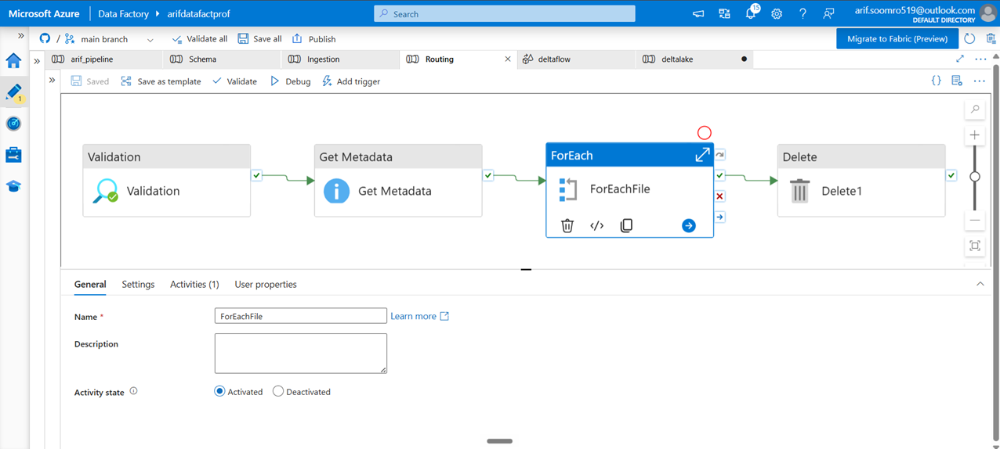
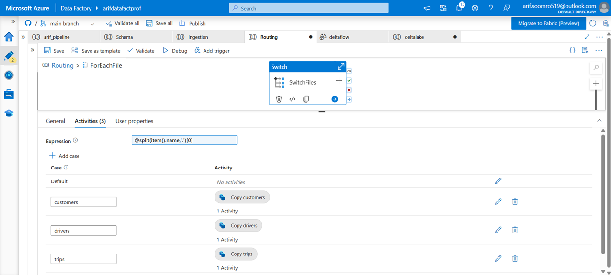

# Azure Data Factory – File-Based Dynamic Routing Pipeline

## 📌 Project Overview

This project demonstrates a **file-based data ingestion and routing pipeline built using Azure Data Factory (ADF)**.

The pipeline was designed for a real-world business scenario where a manager places a data file into a **specific source storage location**. Once the file is available, the ADF pipeline processes the file automatically according to its name and routes it to the appropriate ingestion process.

The main objective of this pipeline is to make the ingestion process **dynamic, reusable, and automated**, without creating a separate pipeline for every file type.

---

## 🎯 Business Scenario

The requirement was:

> Whenever the manager places a required data file in a specific storage location, the pipeline should process that file automatically.

For example, the source location may contain files such as:

* `customers.csv`
* `drivers.csv`
* `trips.csv`

The pipeline identifies the files available in the source location, determines their type from the file name, and sends each file to the appropriate Copy Activity.

After successful processing, the original file is deleted from the source location so that it is not processed again.

---

## 🔄 Pipeline Workflow

The overall workflow of the pipeline is:

**Source Storage → Validation → Get Metadata → ForEach → Switch → Copy Activity → Delete**

### Step 1 – Validation

The pipeline first performs a **validation step**.

This ensures that the required conditions are satisfied before continuing with the data ingestion process.

---

### Step 2 – Get Metadata

The **Get Metadata Activity** retrieves metadata information from the source storage location.

The metadata activity is used to identify the files available in the specified location.

The output contains information about the files, including their names.

Example:

```text
customers.csv
drivers.csv
trips.csv
```

This allows the pipeline to process files dynamically rather than using hardcoded file names.

---

### Step 3 – ForEach Activity

The output of the Get Metadata Activity is passed to the **ForEach Activity**.

The ForEach iterates through each file returned by Get Metadata.

The items expression used for the ForEach is:

```text
@activity('Get Metadata').output.childItems
```

This means that every file returned by Get Metadata is processed one by one.

---

### Step 4 – Switch Activity

Inside the ForEach activity, a **Switch Activity** is used to determine which type of file is being processed.

The Switch expression is:

```text
@split(item().name,'.')[0]
```

This expression extracts the file name before the extension.

For example:

```text
customers.csv → customers
drivers.csv   → drivers
trips.csv     → trips
```

The extracted value is then compared against the Switch cases.

---

## 🔀 File Routing Logic

The Switch contains three cases:

### Case 1 – Customers

```text
customers
```

When the file name is `customers.csv`, the pipeline executes:

```text
Copy Customers
```

This Copy Activity moves the customer data to its designated destination.

### Case 2 – Drivers

```text
drivers
```

When the file name is `drivers.csv`, the pipeline executes:

```text
Copy Drivers
```

This Copy Activity moves the driver data to the appropriate destination.

### Case 3 – Trips

```text
trips
```

When the file name is `trips.csv`, the pipeline executes:

```text
Copy Trips
```

This Copy Activity moves the trip data to its designated destination.

---

## 🗑️ Step 5 – Delete Activity

After the file has been copied successfully, the final activity is the **Delete Activity**.

The purpose of this activity is to remove the processed file from the source storage location.

For example:

```text
Source Storage
     ↓
customers.csv
     ↓
Copy Customers
     ↓
Delete customers.csv
```

This prevents the same file from being processed again during a subsequent pipeline execution.

---

## 🏗️ Pipeline Architecture

The high-level pipeline architecture is:

```text
                 Source Storage
                       │
                       ▼
                 ┌─────────────┐
                 │ Validation  │
                 └──────┬──────┘
                        │
                        ▼
                ┌───────────────┐
                │ Get Metadata  │
                └───────┬───────┘
                        │
                        ▼
                  ┌───────────┐
                  │ ForEach   │
                  └─────┬─────┘
                        │
                        ▼
                  ┌───────────┐
                  │  Switch   │
                  └─────┬─────┘
                        │
          ┌─────────────┼─────────────┐
          ▼             ▼             ▼
     Customers       Drivers        Trips
          │             │             │
          ▼             ▼             ▼
    Copy Activity   Copy Activity   Copy Activity
          │             │             │
          └─────────────┼─────────────┘
                        ▼
                   ┌─────────┐
                   │ Delete  │
                   └─────────┘
```

---

## 🖼️ Pipeline Screenshots

### Main Pipeline

The following screenshot shows the complete ADF pipeline flow, including Validation, Get Metadata, ForEach, and Delete activities.



### Switch-Based File Routing

The following screenshot shows the Switch Activity inside the ForEach loop. The pipeline uses the file name to determine which Copy Activity should be executed.



---

## 🧠 Key ADF Concepts Demonstrated

This project demonstrates practical knowledge of several Azure Data Factory concepts:

* Validation Activity
* Get Metadata Activity
* ForEach Activity
* Switch Activity
* Copy Activity
* Delete Activity
* Dynamic Expressions
* File-based routing
* Metadata-driven processing
* Dynamic file processing
* Conditional execution
* Automated data ingestion

---

## 🔑 Important Dynamic Expressions

### Get Metadata → ForEach

```text
@activity('Get Metadata').output.childItems
```

This retrieves the collection of files returned by the Get Metadata Activity.

### Switch Expression

```text
@split(item().name,'.')[0]
```

This extracts the file name without its extension.

Examples:

```text
customers.csv → customers
drivers.csv   → drivers
trips.csv     → trips
```

---

## ✅ Advantages of This Approach

This architecture provides several benefits:

### Dynamic Processing

The pipeline does not require a separate pipeline execution for every individual file.

### Automated Routing

Files are automatically routed to the correct Copy Activity based on their names.

### Reusability

The same pipeline structure can be extended with additional file types and routing cases.

### Duplicate Prevention

Processed files are deleted from the source location, reducing the possibility of processing the same file multiple times.

### Reduced Manual Intervention

Once the file is placed in the designated source location and the pipeline is triggered, the processing can take place automatically.

---

## 🚀 Possible Future Enhancements

This pipeline can be further improved by adding:

* Storage Event Trigger for automatic execution when a new file arrives
* Error handling and retry mechanisms
* Failure notifications through Logic Apps or email
* Logging and monitoring
* Archive instead of deleting processed files
* Parameterized source and destination paths
* Additional Switch cases for new file types
* Metadata-driven configuration tables

---

## 🛠️ Technologies Used

* **Microsoft Azure**
* **Azure Data Factory**
* **Azure Storage**
* **ADF Copy Activity**
* **ADF Get Metadata Activity**
* **ADF ForEach Activity**
* **ADF Switch Activity**
* **ADF Delete Activity**
* **ADF Dynamic Expressions**

---

## 📚 Project Learning

Through this project, I gained practical experience in designing an **automated, metadata-driven file ingestion pipeline in Azure Data Factory**.

The project helped me understand how ADF can be used to dynamically inspect incoming files, route them according to business rules, move them to the appropriate destination, and clean up the source location after successful processing.

This approach can be extended to more complex enterprise data ingestion scenarios where different file types require different processing logic.

---

## 👨‍💻 Author

**Arif Ali**

Data Engineering | Azure Data Factory | SQL | PySpark | Big Data
